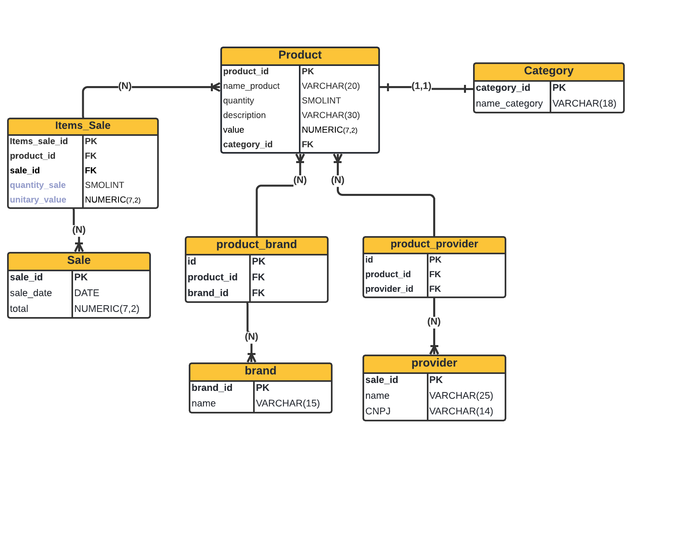

# Bazar-API

### O que é?

API para venda de produtos diversos.

### Cenário

Em um bazar de produtos é possível encontrar diversos tipos de produtos que podem serem fornecidos 
por diversos fornecedores e esses tendo diversas marcas, então será feita a divisão dos produtos em categorias. 

### Funcionalidades prontas

- [X] Mostra todos os produtos disponíveis.
- [X] Buscar um produto pelo id.
- [X] Busca produto pelo nome.
- [X] Adiciona produtos no carrinho de compras, mostra o total e a quantidade dos produtos.
- [X] Realiza a venda dos produtos adicionados no carrinho de compras.
- [X] Atualiza a quantidade do produto após a finalização da venda.

###Novas Funcionalidades
-[ ] Pagamento por cartão de crédito.

### Métodos HTTP utilizados na API

Um quadro simples onde é mostrado os métodos HTTP utilizados, a URI para acessar os recursos disponíveis, 
as query strings ou parameters que são utilizadas para filtrar os dados entre outras funções.
 

| Método HTTP |          URI                |                O que faz?                                                                                          | Caso o recurso não seja encontrado
|-------------|-----------------------------|--------------------------------------------------------------------------------------------------------------------|---------------------------------------------------------------------------------------------------------------|
|   get       |          /products/         | 
Busca todos os produtos paginados.
|
|   get       |    /product/{**id**}        | 
Busca um produto pelo id.

|   get       | /products/{**productName**} | 
Busca produtos pelo nome.

|   get       |         /finally_sale       | 
Mostra os item já adicionados para a compra 
 |
|   post      |        /items_cart          | 
Adiciona produtos no carrinho de compras mostra o total e a quantidade de produtos.
|

### Arquitetura

A arquitetura utilizada é a monolítica, tendo os dados centralizados em apenas uma base de dados
e os recursos aclopados e dependentes, a escolha por essa arquitetura é porque o objetivo é manter
a simplicidade e focar no aprendizado. 

### Modelo Entidade e Relacionamento do Banco de Dados

A imagem a abaixo ilustra como o banco de dados está modelado e o 
 relacionamento entre as entidades que o compõem.

##Tecnologias Utilizadas no Projeto

- Spring Boot
- PostgreSQL
- Swagger
- Flyway
- Docker

O docker é utilizado para rodar um container com o banco de dados PostgreSQL.